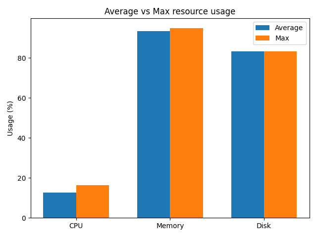

# System snapshots report

- Time range: `2026-02-04T00:03:39.793238+00:00` → `2026-02-04T12:42:11.778928+00:00`
- Snapshots analyzed: **8**

## Metrics summary

| Metric | Min | Avg | Max |
|---|---:|---:|---:|
| CPU (%) | 9.10 | 12.59 | 16.40 |
| MEM (%) | 91.40 | 93.40 | 95.00 |
| DISK (%) | 83.20 | 83.22 | 83.30 |

## Disk (last snapshot)

- Path: `C:\`
- Used: **83.30%**

## Network totals (from deltas)

- Sent total: **33.26 KB**
- Recv total: **70.55 KB**
- Deltas ignored (None): **8**

## Anomalies

- `2026-02-04T00:03:39.793238+00:00` — mem_percent_high (>= 90.0) (cpu=14.10%, mem=95.00%, sent_delta=None, recv_delta=None)
- `2026-02-04T00:06:48.428699+00:00` — mem_percent_high (>= 90.0) (cpu=10.80%, mem=93.50%, sent_delta=None, recv_delta=None)
- `2026-02-04T00:10:12.248836+00:00` — mem_percent_high (>= 90.0) (cpu=9.10%, mem=93.70%, sent_delta=None, recv_delta=None)
- `2026-02-04T00:10:18.049375+00:00` — mem_percent_high (>= 90.0) (cpu=10.60%, mem=93.80%, sent_delta=5.99 KB, recv_delta=10.84 KB)
- `2026-02-04T00:10:23.459028+00:00` — mem_percent_high (>= 90.0) (cpu=14.20%, mem=91.50%, sent_delta=4.94 KB, recv_delta=12.00 KB)
- `2026-02-04T00:10:28.648831+00:00` — mem_percent_high (>= 90.0) (cpu=11.70%, mem=91.40%, sent_delta=10.04 KB, recv_delta=21.63 KB)
- `2026-02-04T12:42:05.483244+00:00` — mem_percent_high (>= 90.0) (cpu=13.80%, mem=93.40%, sent_delta=None, recv_delta=None)
- `2026-02-04T12:42:11.778928+00:00` — mem_percent_high (>= 90.0) (cpu=16.40%, mem=94.90%, sent_delta=12.29 KB, recv_delta=26.08 KB)

## Resource chart

## Last snapshot (raw)

- ts: `2026-02-04T12:42:11.778928+00:00`
- hostname: `Lenovo-MS`
- os: `Windows 11`
- cpu: **16.40%**
- mem: **94.90%** (14.41 GB / 15.19 GB)
- disk: **83.30%** (792.38 GB / 951.80 GB) at `C:\`
- net: sent=93.01 MB, recv=21.57 MB, sent_delta=12.29 KB, recv_delta=26.08 KB

### Top processes (last snapshot)

| PID | Name | CPU (%) | RSS |
|---:|---|---:|---:|
| 0 | System Idle Process | 1340.40 | 8.00 KB |
| 153908 | python.exe | 98.60 | 28.88 MB |
| 4 | System | 45.20 | 140.00 KB |
| 139996 | Antigravity.exe | 10.00 | 448.79 MB |
| 104864 | Code.exe | 9.10 | 252.71 MB |
